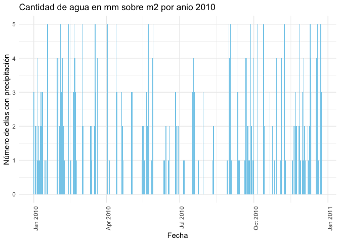

<!-- README.md is generated from README.Rmd. Please edit that file -->

# viajerosiconicos

‘viajerosiconicos’ es un paquete de prueba diseñado para trabajar con
datos meteorológicos históricos. Este paquete permite a los usuarios
analizar las condiciones climáticas de años pasados y realizar resúmenes
sobre temperatura, precipitación y otros fenómenos meteorológicos clave.
Con las funciones incluidas, es posible obtener un análisis detallado de
las temperaturas extremas, la precipitación y más.

Este paquete contiene funciones útiles para calcular y analizar los
datos meteorológicos de forma sencilla. Las siguientes funciones han
sido diseñadas para facilitar el análisis de datos climáticos
históricos.

Es útil para investigadores, estudiantes o cualquier persona interesada
en estudiar el clima de épocas pasadas, haciendo especial énfasis en las
temperaturas extremas, la precipitación y las condiciones que
caracterizaron diferentes años.NO DESCARGAR

<!-- badges: start -->

[](https://lifecycle.r-lib.org/articles/stages.html#experimental)
<!-- badges: end -->

## Installation

You can install the development version of viajerosiconicos from
[GitHub](https://github.com/) with:

``` r
# install.packages("pak")
pak::pak("VictoriaMarull/viajerosiconicos")
```

## Example

This is a basic example which shows you how to solve a common problem:

``` r
library(viajerosiconicos)
library(dplyr)
#> 
#> Attaching package: 'dplyr'
#> The following objects are masked from 'package:stats':
#> 
#>     filter, lag
#> The following objects are masked from 'package:base':
#> 
#>     intersect, setdiff, setequal, union
## basic example code
```

``` r
conversion(98)
#> [1] 36.66667
```

``` r
resumen_meteorologico(dataset_completo, anio_usuario = 1973)
#>   temperatura_media temperatura_maxima temperatura_minima precipitacion_total
#> 1          17.57041                 42                 -4              5602.8
#>   granizo_total horas_frio_total
#> 1             4         2059.685
```

``` r
grafico_precipitacion(dataset_completo, 2010)
```



``` r
temperaturas(dataset_completo, 2011)
#>   Anio Dia_Mas_Calido Temperatura_Maxima Dia_Mas_Frio Temperatura_Minima
#> 1 2011     2011-12-21               33.7   2011-08-01               3.45
```
